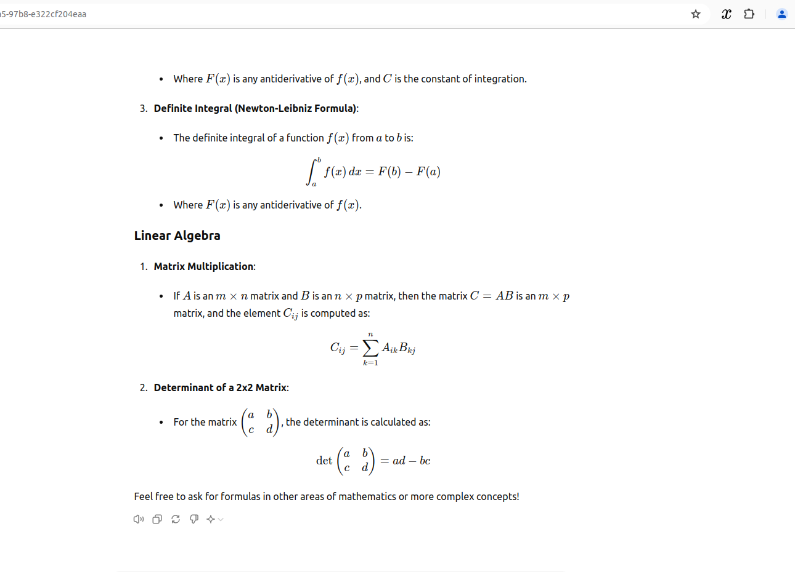
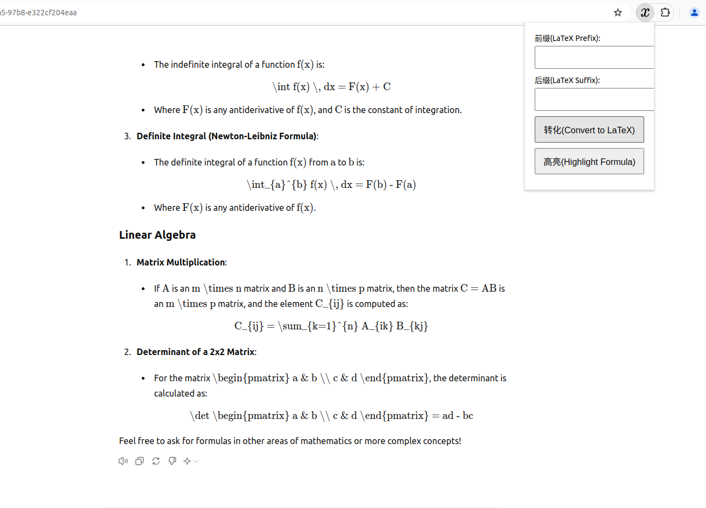
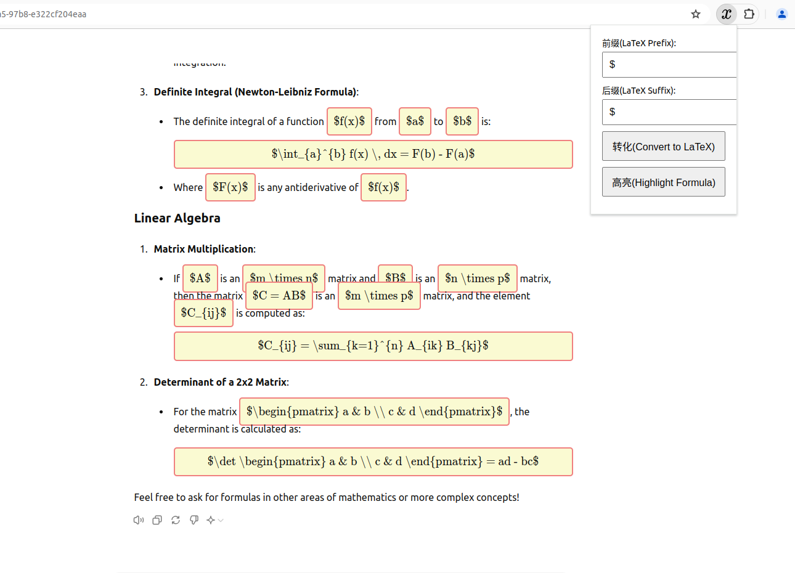

# Web_FormulaToLatex
在网页端禁用公式渲染并转化为Latex公式的源代码，便于用户复制。
为了方便markdown格式渲染，支持一键添加前后缀。
支持高亮显示。
# 演示
## 转换前

## 转换后

## 支持自定义前后缀与高亮

# 使用
1、浏览器扩展打开开发者模式
2、加载已解压的文件（选择math-selector-plugin文件夹）
3、把此扩展固定在扩展栏目中，在有公式的网页中点击使用即可
